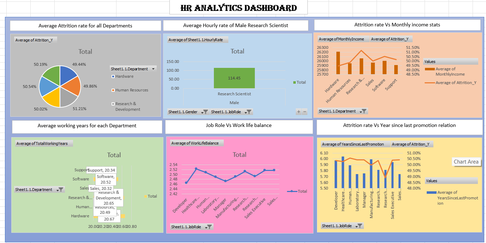
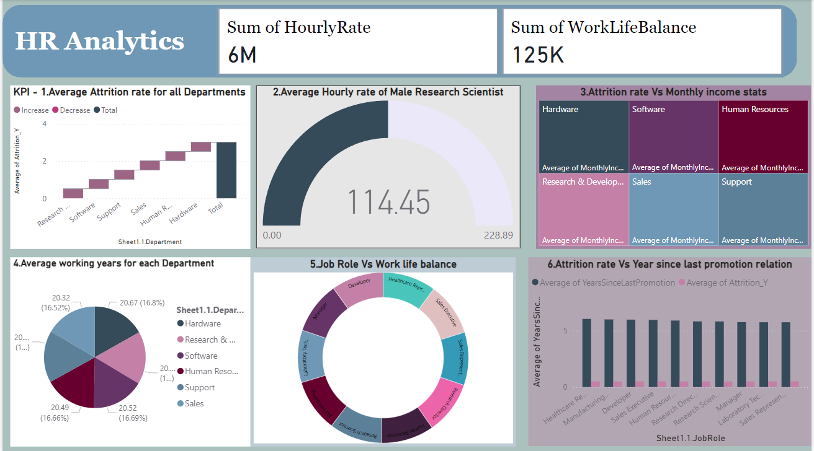
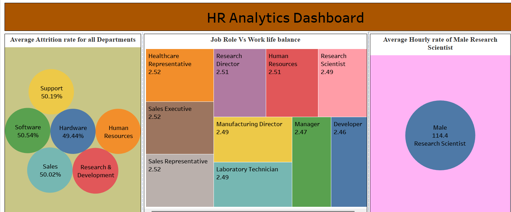
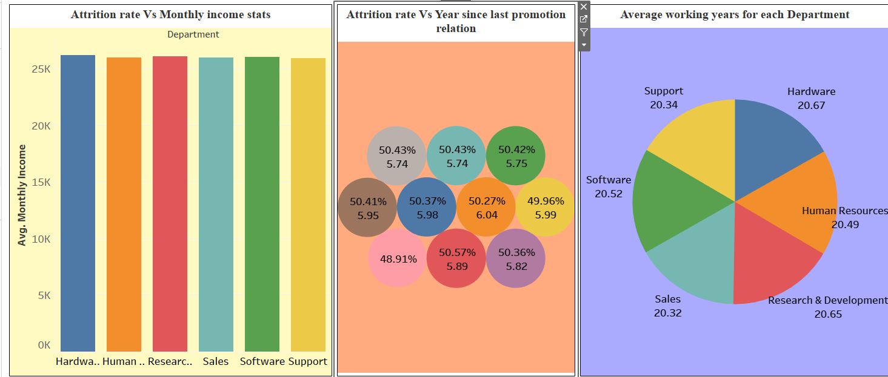

**PROJECT OVERVIEW**

•	Created comprehensive HR analytics dashboards in Excel, Tableau, and Power BI, providing insights into key workforce metrics, such as attrition rates, work-life balance, and promotion trends.

•	Designed and implemented SQL queries to extract, transform, and analyze HR data for KPI reporting, ensuring accurate and actionable insights.

•	Conducted detailed data cleaning and transformation to ensure data quality and consistency across all visualizations.

•	Created clear and impactful data visualizations for each KPI, simplifying complex data and enabling better decision-making.

•	Designed and delivered a PowerPoint presentation to communicate findings and recommendations effectively.

**EXCEL DASHBOARD**

**POWERBI DASHBOARD**

**Tableau DASHBOARD 1**

**Tableau DASHBOARD 2**

